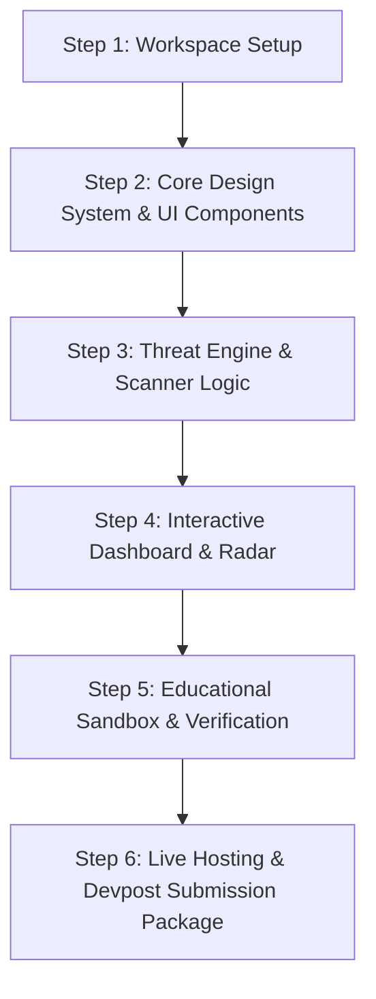

# TLN Cybersecurity Challenge 2026: Action Plan & Project Strategy

## 1. Executive Summary & Hackathon Overview

Based on the official TLN Cybersecurity Challenge 2026 slides, here is what is required:

- **Hard Deadline**: **Sunday, Sept 20 @ 10:00 AM EDT** (Draft submission on Devpost must be locked in by 9:00 AM EDT).
- **Platform**: Devpost ([tln-cybersecurity-challenge.devpost.com](https://tln-cybersecurity-challenge.devpost.com))
- **Total Points**: 100 Points (5 Criteria @ 20 Points each).
- **Key Rules**: Original work built during the hackathon weekend, full disclosure of AI tools/libraries, working prototype + live demo required.

---

## 2. Decoded Judging Criteria (100 Points Total)

| Criterion | Points | What Judges Look For | Winning Strategy |
| :--- | :---: | :--- | :--- |
| **1. Impact & Relevance** | 20 | Real problem & real people it helps | Focus on defending everyday users from AI-powered phishing, deepfake scams, and data breaches. |
| **2. Technical Implementation** | 20 | Engineering holds up & fully functional | Build a robust JavaScript/Vite web platform with modular threat analyzers and pattern engines. |
| **3. Innovation & Creativity** | 20 | Fresh angle judges haven't seen | Multi-vector threat scanner (URL, text, header, QR code) combined with gamified threat simulation. |
| **4. User Experience & Design** | 20 | Usable, visually stunning | Premium cyber dark mode aesthetic, dynamic risk radar, glassmorphic UI, responsive layouts. |
| **5. Presentation & Demo** | 20 | Clear in under 5 minutes | Live interactive demo, crisp GitHub README with visuals, structured video script. |

---

## 3. Required Submission Deliverables

1. **Working Prototype**: Public GitHub repo with structured codebase.
2. **Live Demo**: Hosted web application accessible via browser.
3. **5-Minute Video Demo**: Concise walkthrough showcasing live features without slides clutter.
4. **Tech Stack & AI Disclosure**: Transparent list of languages, frameworks, APIs, and AI assistance used.
5. **Devpost Listing**: Completed form with draft saved early.

---

## 4. Recommended Project Concept: `SentinelGuard AI`

**Tagline**: *Next-Generation AI Cyber Threat Radar & Phishing Defense Platform*

### Key Features
1. **Multi-Vector Phishing & Scam Scanner**: Real-time analysis of URLs, emails, SMS text, and suspicious QR codes with instant threat severity scoring.
2. **Security & Privacy Header Audit**: Live inspector checking web domain security policies (SSL, HSTS, CSP, CORS headers) and data leakage risk.
3. **Interactive Threat Radar & Analytics**: Live visual dashboard with interactive risk charts, threat vector breakdown, and immediate actionable fix steps.
4. **Gamified Security Sandbox ("Phish Hunt")**: Interactive educational module testing users on real vs. AI-crafted phishing tactics.

---

## 5. Implementation Roadmap & Execution Flow

### Proposed Changes

#### [NEW] [index.html](file:///d:/Armaan/TLN%20Hackathon/index.html)
- Main html structure with Google Fonts (Outfit / JetBrains Mono) and metadata.

#### [NEW] [src/style.css](file:///d:/Armaan/TLN%20Hackathon/src/style.css)
- Comprehensive CSS Design System: dark mode palette, neon cyber accents (`#00f3ff`, `#ff0055`, `#10b981`), glassmorphism, keyframe micro-animations.

#### [NEW] [src/app.js](file:///d:/Armaan/TLN%20Hackathon/src/app.js)
- Core logic for real-time URL heuristic analyzer, text pattern scorer, header security evaluator, threat radar rendering, and interactive tab switching.

---

## User Review Required

> [!IMPORTANT]
> **Action Required**: Please confirm if you approve the proposed project concept **SentinelGuard AI** and the implementation plan so we can immediately begin building the complete application!
